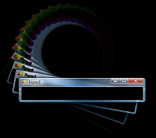

# Fractal Feedback Machine

This is something I wrote long ago, and published to "Codeplex".
Codeplex was eventually archived. Then they deleted their archive.
Nasty business.

When this was written, the .net world was excited that "Iron Python"
a new and dynamic language had been added to the fleet of langs.

I only used IronPython this once, to make a weird dynamic feedback 
thing. I don't think anyone else ever used it.

Cut to 47 years later, and I tried reloading that old project in
a recent version of Visual Studio. 

It loaded first time, no problem. So I'm publishing it now, 10 minutes later.

